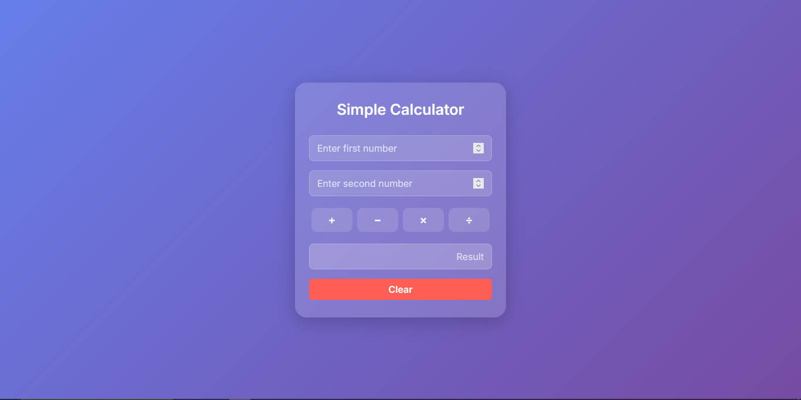

# Simple Calculator

A modern, responsive calculator web app built with HTML, CSS, JavaScript, and Bootstrap.

## Features
- Addition, subtraction, multiplication, and division
- Clean and modern UI with gradient background
- Responsive design for desktop and mobile
- Input validation and error handling (e.g., division by zero)

## Demo
[Live Calculator App](https://pr-1-calaculator-js.vercel.app/)

## Usage
1. Enter two numbers in the input fields.
2. Click the desired operation (+, -, ×, ÷) to see the result.
3. Click "Clear" to reset all fields.

## Technologies Used
- HTML5
- CSS3 (with Bootstrap 5)
- JavaScript

## Screenshot

---

Feel free to use, modify, or share this project!
